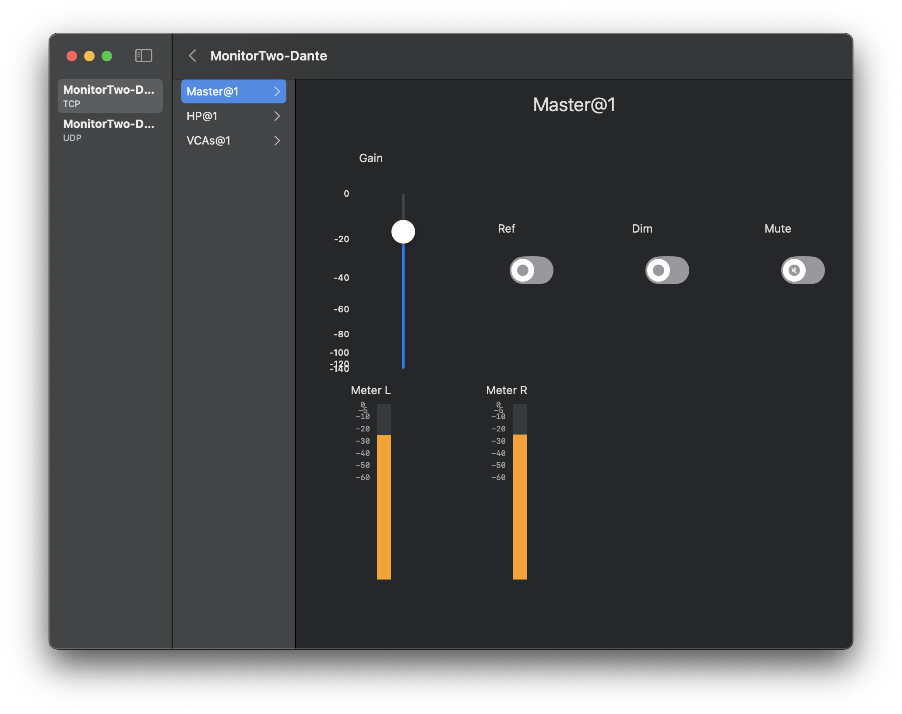

SwiftOCA
--------

SwiftOCA is pure Swift implementation of the [AES70/OCA](https://ocaalliance.com/what-is-aes70/) control protocol, principally used for remote control of professional audio devices.

The package consists of three libraries:

* [SwiftOCA](Sources/SwiftOCA): an OCA controller (client)
* [SwiftOCAUI](Sources/SwiftOCAUI): framework for binding SwiftUI views to OCA classes
* [SwiftOCADevice](Sources/SwiftOCADevice): an OCA device (server)

All APIs use `async/await` and support both macOS and Linux. A sample SwiftUI view library is also included, and a Flutter bridge is under development [here](https://github.com/PADL/FlutterSwiftOCA). Examples can be found in [Examples](Examples).

| Platform | TCP | UDP | WS client | WS server | Local |
| -:       | :-  | :-  | :-        | :-        | :-    |
| macOS    | ✅  | ❌  | ❌        | ✅        | ✅    |
| Linux    | ✅  | ✅  | ❌        | ❌        | ✅    |

Below is a screenshot generated using `SwiftOCAUI` controls:

--
Luke Howard <lukeh@lukktone.com>

