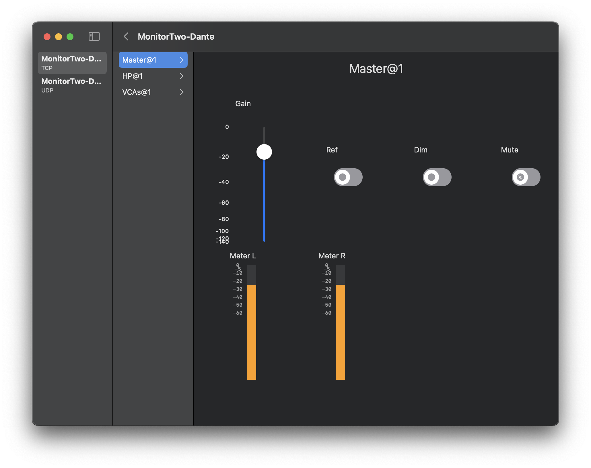

SwiftOCA
--------

SwiftOCA is a pure Swift implementation of the [AES70](https://ocaalliance.com/what-is-aes70/) control protocol, principally used for remote control of professional audio devices.

The package consists of three libraries:

* [SwiftOCA](Sources/SwiftOCA): an OCA controller (client)
* [SwiftOCAUI](Sources/SwiftOCAUI): SwiftUI views for binding to OCA classes (macOS/iOS)
* [SwiftOCADevice](Sources/SwiftOCADevice): an OCA device (server)

All APIs are async-safe and support both macOS and Linux: on macOS, [FlyingFox](https://github.com/swhitty/FlyingFox) is used for socket I/O, and on Linux, [IORingSwift](https://github.com/PADL/IORingSwift).

| Platform | TCP | UDP client | UDP server | WS client | WS server | Local |
| -:       | :-  | :-         | :-         | :-        | :-        | :-    |
| macOS    | ✅  | ✅         | ✅         | ❌        | ✅        | ✅    |
| Linux    | ✅  | ✅         | ✅         | ❌        | ❌        | ✅    |

## Features

### Controller (SwiftOCA)

* **Device discovery**: `OcaConnectionBroker` discovers AES70 devices via DNS-SD/Bonjour (using `NetServiceBrowser` on Apple platforms, or `libdns_sd` on Linux), with support for both TCP and UDP service types. Devices can also be registered manually for direct connection without DNS-SD.
* **Property observation**: `@OcaProperty` and `@OcaBoundedProperty` wrappers expose property changes as `AsyncSequence` streams, enabling reactive UI updates.
* **JSON serialization**: read the full state of any remote object or block tree as a JSON-compatible dictionary via `jsonObject`.
* **Automatic reconnection**: optionally reconnect when a connection drops or a device's IP address changes via mDNS, with configurable options for subscription refresh and object cache retention.

### Device (SwiftOCADevice)

* **Full AES70 device implementation**: host actuators, sensors, blocks, matrices, managers, and agents.
* **`@OcaDeviceProperty`**: property wrapper that manages local state and notifies connected controllers on changes.
* **Block and matrix containers**: `OcaBlock` and `OcaMatrix` for organizing objects into hierarchical or grid-based topologies.
* **JSON serialization/deserialization**: persist and restore device state via `serialize`/`deserialize` and the parameter dataset API.
* **Multiple transport endpoints**: run TCP, UDP, WebSocket, and Unix domain socket endpoints concurrently.

### SwiftOCAUI

* **Automatic view dispatch**: the `OcaView` protocol and `OcaDetailView` select specialized views based on OCA class type.
* **Pre-built actuator views**: gain slider (log-scaled), mute toggle, polarity switch, pan/balance knob, boolean and float actuators.
* **Sensor views**: level meter with PPM ballistics (color-coded bar graph), identification sensor, and generic sensor displays.
* **Block navigation**: drill-down sidebar for hierarchical blocks; grid layout for leaf blocks; matrix navigation support.
* **Bonjour discovery view**: ready-made device browser view for listing and connecting to discovered devices.

## Examples

Sample code can be found in [Examples](Examples):

* **[OCADevice](Examples/OCADevice)** — a sample AES70 device with a gain control, boolean actuator matrix, and multiple transport endpoints.
* **[OCABrowser](Examples/OCABrowser)** — a macOS SwiftUI app that discovers devices via Bonjour and provides a navigable block browser with specialized control views.
* **[OCABrokerTest](Examples/OCABrokerTest)** — a command-line tool that discovers devices and auto-connects as they appear.

[ocacli](https://github.com/PADL/ocacli) is a command-line OCA controller that is implemented using SwiftOCA. SwiftOCA is also compatible with third-party OCA controllers such as [AES70Explorer](https://aes70explorer.com).

A Flutter wrapper is available [here](https://github.com/PADL/FlutterSwiftOCA).



### Walking the device tree

Connect to a device and recursively print the role path of every object:

```swift
import SwiftOCA

let connection = try await Ocp1TCPConnection(deviceAddress: deviceAddress)
try await connection.connect()

for actionObject in try await connection.rootBlock.resolveActionObjectsRecursive()
  .compactMap({ $0.memberObject as? OcaOwnable }) {
  try? await print("- \(actionObject.rolePathString)")
}

try? await connection.disconnect()
```

### Observing property changes

Subscribe to a gain property and react to changes:

```swift
import SwiftOCA

let connection = try await Ocp1TCPConnection(deviceAddress: deviceAddress)
try await connection.connect()

let gain = try await connection.resolve(object: OcaGain.self, objectNumber: gainONo)
for try await value in gain.$gain {
  print("gain changed to \(value) dB")
}
```

### Hosting a device

Create an AES70 device with a gain control and serve it over TCP:

```swift
import SwiftOCADevice

let device = OcaDevice.shared
try await device.initializeDefaultObjects()

let gain = try await OcaGain(
  objectNumber: 10020,
  role: "Main Gain",
  deviceDelegate: device
)

let endpoint = try await Ocp1FlyingSocksStreamDeviceEndpoint(address: listenAddress)
try await endpoint.run()
```

### Discovering devices with OcaConnectionBroker

Use `OcaConnectionBroker` to discover devices on the network and connect automatically:

```swift
import SwiftOCA

let broker = await OcaConnectionBroker(
  connectionOptions: Ocp1ConnectionOptions(flags: [
    .automaticReconnect,
    .refreshSubscriptionsOnReconnection,
  ])
)

for try await event in await broker.events {
  switch event.eventType {
  case .deviceAdded:
    try await broker.connect(device: event.deviceIdentifier)
    print("connected to \(event.deviceIdentifier.name)")
  case .deviceRemoved:
    print("lost \(event.deviceIdentifier.name)")
  default:
    break
  }
}
```

## License

Apache License 2.0. See [LICENSE.md](LICENSE.md).

Luke Howard <lukeh@lukktone.com>
