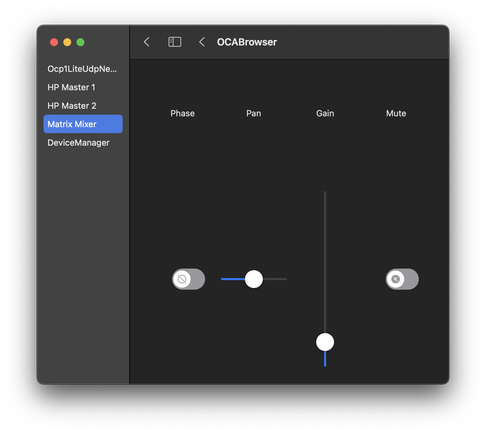

SwiftOCA
--------

SwiftOCA is pure Swift implementation of the AES70/OCA control protocol. It provides asynchronous controller and device APIs and supports both macOS and Linux. It also includes a SwiftUI view library.

Many OCA classes remain to be implemented, and the UI controls aren't going to win any design awards, so consider it a work in progress. Pull requests welcome.

Luke Howard <lukeh@lukktone.com>

